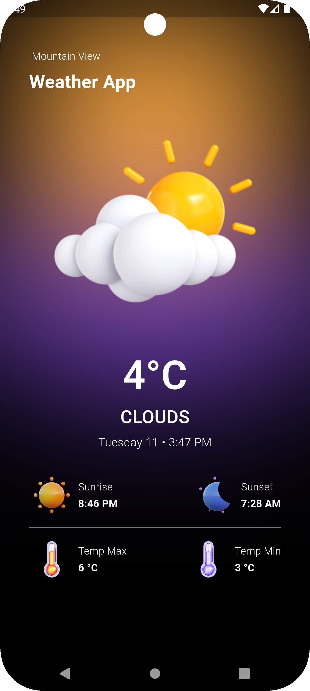

# Weather App

A Flutter application that provides local weather updates using the OpenWeather API. Built with Flutter Bloc architecture for state management.

## Features
- Get real-time weather updates
- Display temperature, humidity, and weather conditions
- Beautiful UI with dynamic weather icons

## Screenshots
  

## Getting Started

This project is a starting point for a Flutter application.

### Prerequisites
- Flutter SDK installed
- OpenWeather API key

### Installation
1. Clone the repository:
   ```sh  
   git clone https://github.com/Siz-An/Weather-App-Flutter
